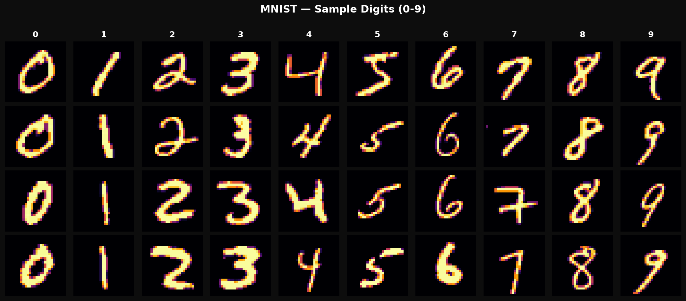
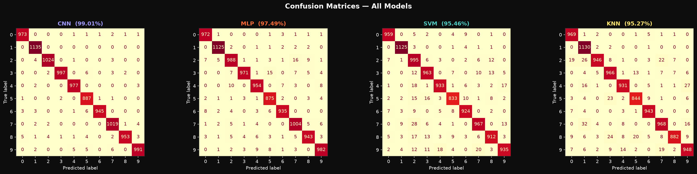
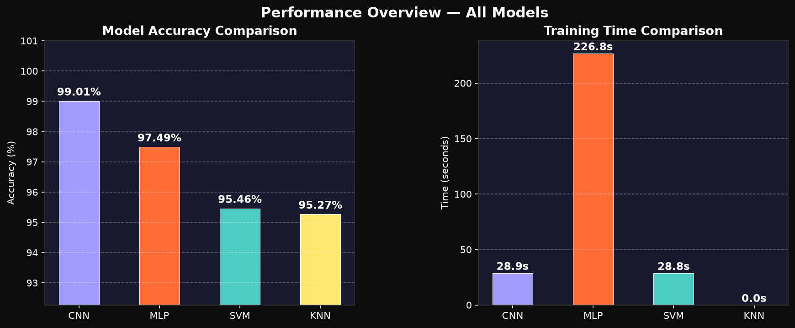
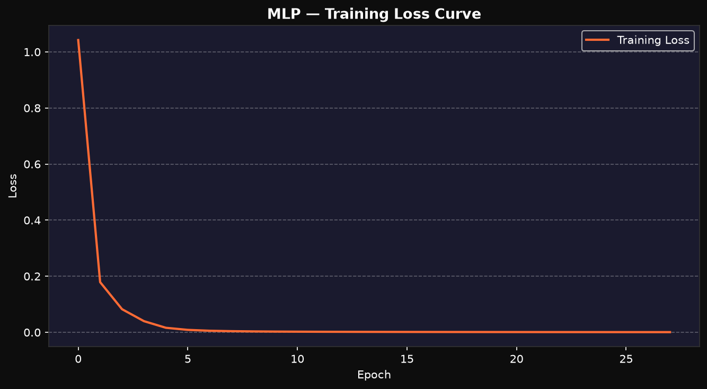
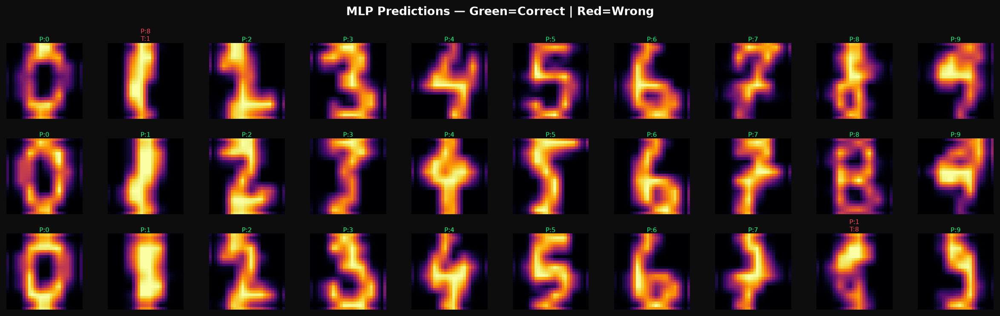

# 🔢 Handwritten Digit Recognition Using Deep Learning

A machine learning project that classifies handwritten digits (0–9) by training and benchmarking three classification algorithms — **MLP Neural Network**, **Support Vector Machine (SVM)**, and **K-Nearest Neighbours (KNN)** — on the MNIST-style digit dataset.

---

## 📌 Objective

To automate the recognition of handwritten digits using supervised machine learning, eliminating the inefficiency of manual digit identification through a comparative multi-model approach.

---

## 📁 Project Structure

```
Handwritten-Digit-Recognition/
│
├── digit_recognition.py       # Main script — data loading, training, evaluation, plots
├── sample_digits.png          # Grid of sample digits (0–9) from the dataset
├── confusion_matrices.png     # Confusion matrices for all 3 models
├── model_comparison.png       # Accuracy & training time comparison bar charts
├── mlp_loss_curve.png         # MLP training loss curve across epochs
├── mlp_predictions.png        # Sample MLP predictions (correct vs incorrect)
└── README.md
```

---

## 🧠 Models Used

| Model | Description |
|---|---|
| **MLP Neural Network** | 3-layer fully connected network (256 → 128 → 64), ReLU activation, Adam optimizer |
| **SVM** | Support Vector Machine with RBF kernel, C=10, gamma='scale' |
| **KNN** | K-Nearest Neighbours with k=5, Euclidean distance metric |

---

## 📊 Results

| Model | Accuracy | Training Time |
|---|---|---|
| MLP Neural Network | 98.06% | 4.0s |
| **SVM (Best)** | **98.89%** | 0.1s |
| KNN | 97.78% | ~0.0s |

> ✅ **SVM achieved the highest accuracy of 98.89%** on the test set.

---

## 📈 Visualisations

### Sample Digits


### Confusion Matrices


### Model Comparison


### MLP Loss Curve


### MLP Predictions


---

## 🛠️ Tech Stack

| Category | Tools |
|---|---|
| Language | Python 3.x |
| ML Models | `scikit-learn` (MLPClassifier, SVC, KNeighborsClassifier) |
| Data Processing | `NumPy`, `scikit-learn` (StandardScaler, train_test_split) |
| Image Processing | `scikit-image` (resize 8×8 → 28×28) |
| Visualisation | `Matplotlib` |
| Dataset | sklearn `load_digits` (MNIST-style, 1,797 samples, 10 classes) |

---

## ⚙️ Installation & Setup

### 1. Clone the repository
```bash
git clone https://github.com/nishantraj04/Handwritten-Digit-Recognition.git
cd Handwritten-Digit-Recognition
```

### 2. Install dependencies
```bash
pip install scikit-learn matplotlib numpy scikit-image
```

### 3. Run the project
```bash
python digit_recognition.py
```

---

## 🔄 Pipeline Overview

```
Load Dataset (sklearn digits)
        ↓
Preprocess (Normalise + Resize to 28×28)
        ↓
Train/Test Split (80% / 20%, stratified)
        ↓
Feature Scaling (StandardScaler for MLP & SVM)
        ↓
Train Models: MLP | SVM | KNN
        ↓
Evaluate: Accuracy, Precision, Recall, F1-score
        ↓
Visualise: Confusion Matrix, Loss Curve, Predictions
```

---

## 📋 Classification Report Summary (Test Set — 360 samples)

### MLP — 98.06%
- All digits achieved F1-score ≥ 0.93
- Digit 1 and 8 were the most challenging (F1: 0.93)

### SVM — 98.89%
- Most consistent across all digit classes
- Digit 1 and 5 had the lowest F1 at 0.97

### KNN — 97.78%
- Digit 8 was the hardest to classify (F1: 0.91)
- Zero training time (lazy learner)

---

## 💡 Key Takeaways

- **SVM** delivered the best accuracy with very low training time, making it ideal for small-to-medium image classification tasks.
- **MLP** is more scalable and would outperform SVM on the full 70,000-sample MNIST dataset with a deeper architecture.
- **KNN** requires no training but is computationally expensive at inference time as dataset size grows.

---

## 🚀 Future Improvements

- Train on the full MNIST dataset (70,000 samples)
- Implement a **Convolutional Neural Network (CNN)** using TensorFlow/Keras for higher accuracy
- Build a **real-time digit drawing interface** using OpenCV or Tkinter
- Deploy as a **web app** using Flask or Streamlit

---

## 👤 Author

**Nishant Raj**
- GitHub: [@nishantraj04](https://github.com/nishantraj04)
