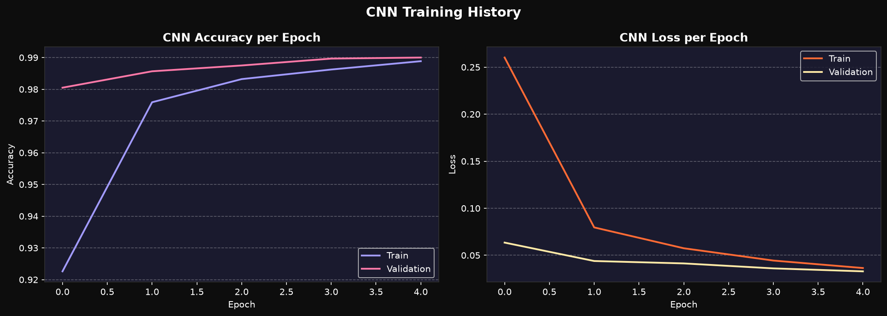
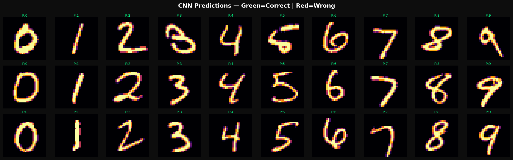

# 🔢 Handwritten Digit Recognition Using Deep Learning

A deep learning project that classifies handwritten digits (0–9) by training and benchmarking four models — **CNN**, **MLP Neural Network**, **Support Vector Machine (SVM)**, and **K-Nearest Neighbours (KNN)** — on the full MNIST dataset (70,000 samples). Includes a live interactive web app for real-time digit prediction.

🚀 **[Live Demo → handwritten-digit-recognition--nishantraj04.streamlit.app](https://handwritten-digit-recognition--nishantraj04.streamlit.app)**

---

## 📌 Objective

To automate the recognition of handwritten digits using deep learning and classical ML, and to conduct a comparative analysis of model accuracy, training time, and scalability across architectures.

---

## 📁 Project Structure

```
Handwritten-Digit-Recognition/
│
├── digit_recognition.py       # Main script — data loading, training, evaluation, plots
├── app.py                     # Streamlit web app for real-time digit prediction
├── cnn_model.h5               # Saved CNN model (trained on full MNIST 60k)
├── requirements.txt           # Python dependencies for deployment
├── .python-version            # Pins Python 3.11 for TensorFlow compatibility
│
├── sample_digits.png          # Grid of MNIST sample digits (0–9)
├── confusion_matrices.png     # Side-by-side confusion matrices for all 4 models
├── model_comparison.png       # Accuracy & training time comparison bar charts
├── cnn_training_history.png   # CNN accuracy & loss curves across 5 epochs
├── cnn_predictions.png        # CNN sample predictions (correct vs incorrect)
│
└── README.md
```

---

## 🧠 Models Used

| Model | Architecture | Dataset Used |
|---|---|---|
| **CNN** | Conv2D(32) → MaxPool → Conv2D(64) → MaxPool → Dense(128) → Dropout(0.3) → Softmax | Full 60k |
| **MLP** | 3-layer fully connected (256 → 128 → 64), ReLU, Adam optimizer | Full 60k |
| **SVM** | RBF kernel, C=10, gamma='scale' | 15k stratified subset |
| **KNN** | k=5, Euclidean distance | 15k stratified subset |

> SVM and KNN use a 15k stratified subset — RBF-SVM is O(n²/n³) and becomes impractical on 60k samples.

---

## 📊 Results

| Model | Test Accuracy | Training Time | Dataset |
|---|---|---|---|
| **CNN** | **99.01%** 🥇 | 28.9s | Full 60k |
| MLP | 97.49% | 226.8s | Full 60k |
| SVM | 95.46% | 28.8s | 15k subset |
| KNN | 95.27% | ~0.0s | 15k subset |

> Test set: 10,000 samples from the official MNIST test split.

---

## 📈 Visualisations

### Sample MNIST Digits (0–9)


### Confusion Matrices — All 4 Models


### Model Accuracy & Training Time Comparison


### CNN Training History (Accuracy & Loss per Epoch)


### CNN Sample Predictions


---

## 🛠️ Tech Stack

| Category | Tools |
|---|---|
| Language | Python 3.11 |
| Deep Learning | `TensorFlow 2.21` / `Keras` (CNN) |
| Classical ML | `scikit-learn` (MLP, SVM, KNN) |
| Data Processing | `NumPy`, StandardScaler, stratified train/test split |
| Visualisation | `Matplotlib` |
| Web App | `Streamlit`, `streamlit-drawable-canvas` |
| Dataset | MNIST via `tensorflow.keras.datasets` (70,000 samples, 28×28 grayscale) |

---

## ⚙️ Installation & Setup

> Requires **Python 3.11** — TensorFlow 2.x does not support Python 3.12+

### 1. Clone the repository
```bash
git clone https://github.com/nishantraj04/Handwritten-Digit-Recognition.git
cd Handwritten-Digit-Recognition
```

### 2. Install dependencies
```bash
pip install tensorflow==2.21.0 scikit-learn matplotlib numpy Pillow streamlit streamlit-drawable-canvas
```

### 3. Train all models and generate plots
```bash
python digit_recognition.py
```

### 4. Run the web app locally
```bash
streamlit run app.py
```

---

## 🔄 Pipeline Overview

```
Load MNIST Dataset (70,000 samples, 28×28 grayscale)
                ↓
Preprocess — Normalise pixels to [0,1], reshape for CNN (28×28×1)
                ↓
Stratified Train/Test Split (60k train / 10k test)
                ↓
Feature Scaling — StandardScaler for MLP & SVM
                ↓
        Train 4 Models in parallel
   CNN  |   MLP   |   SVM   |   KNN
                ↓
Evaluate — Accuracy, Precision, Recall, F1-score, Confusion Matrix
                ↓
Visualise — Training curves, model comparison, sample predictions
                ↓
Deploy — Streamlit web app with MNIST-style preprocessing for live inference
```

---

## 📋 Classification Report Summary (Test Set — 10,000 samples)

### CNN — 99.01%
- Achieved F1-score of 0.99 across all 10 digit classes
- Best overall model with the highest precision and recall consistency

### MLP — 97.49%
- All digits achieved F1-score ≥ 0.96
- Longest training time (226.8s) due to full 60k dataset with 30 epochs

### SVM — 95.46%
- Digit 2 had the lowest F1 (0.93) — commonly confused with 3
- Strong for a classical model on a 15k subset

### KNN — 95.27%
- Zero training time (lazy learner — all computation at inference)
- Digit 8 was hardest to classify (F1: 0.94)

---

## 🖥️ Web App

The Streamlit app allows users to draw any digit (0–9) on a canvas and receive real-time predictions from the CNN model.

**Preprocessing pipeline (MNIST-style):**
1. Capture canvas drawing (280×280)
2. Find bounding box of drawn digit
3. Crop, pad, and center the digit
4. Resize to 28×28 (MNIST resolution)
5. Normalise to [0,1] and run CNN inference

🚀 **[Try it live → handwritten-digit-recognition--nishantraj04.streamlit.app](https://handwritten-digit-recognition--nishantraj04.streamlit.app)**

---

## 💡 Key Takeaways

- **CNN** is the clear winner for image classification — spatial feature extraction via Conv2D layers gives it a decisive edge over flat MLP inputs.
- **MLP** on full 60k is competitive but slower; benefits from large data but lacks spatial awareness.
- **SVM** achieves strong results on a 15k subset but doesn't scale well to 60k due to O(n²) complexity of RBF kernel.
- **KNN** has zero training time but is a lazy learner — all compute shifts to inference, making it slow at scale.

---

## 👤 Author

**Nishant Raj**
- GitHub: [@nishantraj04](https://github.com/nishantraj04)
- Institution: ITER, SOA University — B.Tech CSE (2023–2027)